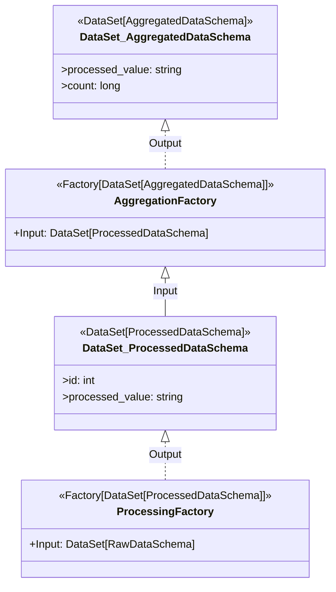

# Advanced Pipeline Operations and Testing

The `Pipeline` (`src/pysetl/workflow/pipeline.py`) is the central orchestrator
in PySetl, bringing together factories, stages, the dispatcher, and the
inspector to execute your ETL workflows. Beyond simply adding stages, PySetl
provides powerful mechanisms to manage external inputs, inspect intermediate
results, and thoroughly test your entire pipeline.

## Pipeline Building and Execution Flow (Brief Review)

Before diving into advanced operations, let's quickly recap how a pipeline is
typically constructed and executed:

1.  **Initialization:** You start by getting a `PySetl` instance and creating a
new pipeline.
    ```python
    from pysetl import PySetl
    pipeline = PySetl.builder().getOrCreate().new_pipeline()
    ```
2.  **Adding Stages/Factories:** You add your `Stage` instances or `Factory`
types (which are wrapped in new stages).
    ```python
    from pysetl.workflow import Stage
    # ... define MyFactory1, MyFactory2 ...
    pipeline.add_stage_from_type(MyFactory1, param1="value") \
            .add_stage(Stage().add_factory_from_type(MyFactory2))
    ```
3.  **Execution:** The `run()` method orchestrates the entire process.
    ```python
    pipeline.run()
    ```
    During `run()`, the `Pipeline`:
    * Initializes the `Inspector` to build and validate the Directed Acyclic
      Graph (DAG) of your workflow, ensuring no circular dependencies and that
      all dependencies can be met.
    * Initializes the `Dispatcher`, which will manage the runtime injection of
      `Deliverables` into `Delivery` slots.
    * Iterates through each `Stage` in sequential order.
    * For each `Stage`, it calls `dispatcher.dispatch()` for all factories in
      that stage to inject their inputs.
    * Finally, it calls `dispatcher.collect_stage_deliverables()` to make the
      outputs of the current stage's factories available for subsequent stages.

## How to Set External Deliverables from the Pipeline

Often, your pipeline will need to consume data that doesn't originate from
another PySetl `Factory` within the same pipeline run. This could be data loaded
from a file, a database, an API, or even mock data for testing. PySetl handles
this gracefully through **external deliverables**.

The `set_input_from_deliverable()` method on the `Pipeline` allows you to
register a `Deliverable` that represents an external input. The `Dispatcher`
will then recognize this `Deliverable` as a potential source for `Delivery`
requests where the `producer` is `External`.

**Key Points:**

* **`Deliverable` Instance:** You must create a `Deliverable` instance,
  providing the actual `payload` (e.g., a Spark `DataFrame`) and explicitly
  setting its `producer` to `External`.
* **Matching `delivery_id`:** If the `Delivery` in your consuming `Factory`
  specifies a `delivery_id`, the `Deliverable` you register externally *must*
  have the same `delivery_id` for the `Dispatcher` to correctly match them.

**Example:**

Let's assume you have a `RawDataSchema` and a `ProcessingFactory` that expects
`DataSet[RawDataSchema]` from an `External` source:

```python
from pysetl.workflow import Factory, Delivery, External, Deliverable
from pysetl import PySetl
from typedspark import DataSet, Column
from pyspark.sql import SparkSession
from pyspark.sql.types import StringType, IntegerType

# 1. Define your schemas (e.g., in etl/schemas.py)
class RawDataSchema(DataSet):
    id: Column[IntegerType]
    value: Column[StringType]

class ProcessedDataSchema(DataSet):
    id: Column[IntegerType]
    processed_value: Column[StringType]

# 2. Define a Factory that consumes external data
class ProcessingFactory(Factory[DataSet[ProcessedDataSchema]]):
    # Declare that this factory needs RawDataSchema from an External source
    # Use a delivery_id to uniquely identify this specific external input
    raw_data_input = Delivery[DataSet[RawDataSchema]](
        producer=External,
        delivery_id="initial_raw_data_batch"
    )

    def read(self) -> Self:
        self.raw_df = self.raw_data_input.get()
        self.log_info(f"ProcessingFactory read {self.raw_df.count()} rows from external input.")
        return self

    def process(self) -> Self:
        self.processed_df = self.raw_df.withColumn("processed_value", col("value").cast(StringType()))
        return self

    def write(self) -> Self:
        self.log_info("ProcessingFactory writing processed data (simulated).")
        return self

    def get(self) -> DataSet[ProcessedDataSchema]:
        return DataSet[ProcessedDataSchema](self.processed_df)

# 3. Create a SparkSession and some mock data
spark = SparkSession.builder.appName("ExternalInputExample").getOrCreate()
mock_raw_df = spark.createDataFrame([(1, "abc"), (2, "def"), (3, "ghi")], ["id", "value"])

# 4. Create the external Deliverable
external_input_deliverable = Deliverable[DataSet[RawDataSchema]](
    payload=DataSet[RawDataSchema](mock_raw_df), # Wrap your Spark DataFrame in a TypedSpark DataSet
    producer=External,
    delivery_id="initial_raw_data_batch" # MUST match the delivery_id in the Delivery
)

# 5. Build and run the pipeline, registering the external deliverable
pipeline = (
    PySetl.builder()
    .getOrCreate()
    .new_pipeline()
    .set_input_from_deliverable(external_input_deliverable) # Register the external input here
    .add_stage_from_type(ProcessingFactory)
)

# pipeline.run() # Uncomment to run the pipeline

# You can inspect the output of the pipeline
# final_output = pipeline.get_last_output()
# print("\nFinal Output Schema:")
# final_output.printSchema()
# print("\nFinal Output Data:")
# final_output.show()
```

By using `set_input_from_deliverable()`, you explicitly tell the PySetl
`Dispatcher` where to find the data for `Deliveries` marked as `External`,
seamlessly integrating external sources into your declarative pipeline.

## How to Inspect Intermediate and Last Output from a Pipeline

After a pipeline `run()`, you often need to retrieve the results of specific
factories, whether it's the final output of the entire pipeline or an
intermediate result from a factory within an earlier stage. PySetl provides
convenient methods for this: `get_last_output()` and `get_output()`.

### 1. `get_last_output()`: Retrieving the Final Result

This method is a shortcut to get the `payload` (the actual data, typically a
Spark `DataFrame` wrapped in a `DataSet`) from the very last factory that
executed in the pipeline's last stage.

**Method Signature:**

```python
get_last_output(self: Self) -> Any
```

**Returns:**

  * `Any`: The output data from the last factory, or `None` if no stages or
    factories are present in the pipeline.

**Example:**

```python
# (Continuing from the previous example where 'pipeline' has run)
# Assuming the pipeline from the 'External Deliverables' example has run
# For demonstration, let's re-run a simple pipeline
spark = SparkSession.builder.appName("OutputInspectionExample").getOrCreate()
mock_raw_df_for_output = spark.createDataFrame([(1, "X"), (2, "Y")], ["id", "value"])
external_input_for_output = Deliverable[DataSet[RawDataSchema]](
    payload=DataSet[RawDataSchema](mock_raw_df_for_output),
    producer=External,
    delivery_id="output_test_data"
)

output_pipeline = (
    PySetl.builder()
    .getOrCreate()
    .new_pipeline()
    .set_input_from_deliverable(external_input_for_output)
    .add_stage_from_type(ProcessingFactory)
)
output_pipeline.run()

final_result_data = output_pipeline.get_last_output()

if final_result_data:
    print("\n--- Last Output of Pipeline ---")
    final_result_data.show()
else:
    print("\nNo output found from the last factory in the pipeline.")
```

### 2. `get_output(factory_type)`: Retrieving Specific Factory Outputs

This method allows you to retrieve the `payload` from a specific `Factory` type
within your pipeline, regardless of its position. This is invaluable for
debugging, auditing, or building subsequent processes that depend on a
particular intermediate result.

**Method Signature:**

```python
get_output(self: Self, factory_type: type[Factory]) -> Any
```

**Parameters:**

  * `factory_type (type[Factory])`: The `Factory` class (not an instance) whose
    output you want to retrieve.

**Returns:**

  * `Any`: The output data from the specified factory.

**Raises:**

  * `PipelineException`: If no factory of the specified `factory_type` is found
    in the pipeline.

**Example:**

Let's add another factory to our previous example, and then retrieve its output.

```python
from pyspark.sql.functions import col
from pyspark.sql.types import LongType

# Define a new schema for aggregated data
class AggregatedDataSchema(DataSet):
    processed_value: Column[StringType]
    count: Column[LongType]

# Define an Aggregation Factory that consumes ProcessedDataSchema
class AggregationFactory(Factory[DataSet[AggregatedDataSchema]]):
    processed_data_input = Delivery[DataSet[ProcessedDataSchema]]()

    def read(self) -> Self:
        self.processed_df = self.processed_data_input.get()
        self.log_info(f"AggregationFactory read {self.processed_df.count()} rows from ProcessedData.")
        return self

    def process(self) -> Self:
        self.aggregated_df = self.processed_df.groupBy("processed_value").count()
        return self

    def write(self) -> Self:
        self.log_info("AggregationFactory writing aggregated data (simulated).")
        return self

    def get(self) -> DataSet[AggregatedDataSchema]:
        return DataSet[AggregatedDataSchema](self.aggregated_df)

# Create SparkSession and mock data
spark = SparkSession.builder.appName("OutputInspectionExample").getOrCreate()
mock_raw_df = spark.createDataFrame([(1, "A"), (2, "B"), (3, "A"), (4, "C")], ["id", "value"])
external_input_deliverable = Deliverable[DataSet[RawDataSchema]](
    payload=DataSet[RawDataSchema](mock_raw_df),
    producer=External,
    delivery_id="initial_raw_data_batch"
)

# Build and run the pipeline with both factories
pipeline = (
    PySetl.builder()
    .getOrCreate()
    .new_pipeline()
    .set_input_from_deliverable(external_input_deliverable)
    .add_stage_from_type(ProcessingFactory)
    .add_stage_from_type(AggregationFactory) # Add the new factory
)

pipeline.run()

# Retrieve output from the ProcessingFactory (intermediate)
processing_output = pipeline.get_output(ProcessingFactory)
print("\n--- Output from ProcessingFactory (Intermediate) ---")
processing_output.show()

# Retrieve output from the AggregationFactory (final)
aggregation_output = pipeline.get_output(AggregationFactory)
print("\n--- Output from AggregationFactory (Final) ---")
aggregation_output.show()

# This is equivalent to get_last_output() in this specific pipeline setup
last_output = pipeline.get_last_output()
print("\n--- Last Output (same as AggregationFactory output) ---")
last_output.show()
```

These methods provide powerful introspection capabilities, allowing you to
verify data at various points in your pipeline and build robust testing
strategies.

## How to Diagram a Pipeline

PySetl provides built-in capabilities to visualize your pipeline's structure as
a Directed Acyclic Graph (DAG) using **Mermaid syntax**. This is incredibly
useful for understanding complex data flows, documenting your ETL processes, and
debugging dependency issues. The `Pipeline.to_diagram()` method generates this
visual representation.

The diagramming functionality is powered by the `Inspector` which constructs
the `DAG` from your pipeline's stages and factories.

**Generating the Diagram:**

To get the Mermaid diagram string, simply call `to_diagram()` on your `Pipeline`
instance:

```python
# (Continuing with the 'pipeline' from the previous example, after it's built)
diagram_string = pipeline.to_diagram()
print("\n--- Pipeline Mermaid Diagram ---")
print(diagram_string)
```

**Interpreting the Diagram:**

The generated string is in Mermaid syntax, which can be rendered by various
tools (e.g., Mermaid Live Editor, GitHub Markdown, VS Code extensions). The
diagram typically shows:

  * **Nodes (`class` blocks):** Each `Factory` in your pipeline is represented
    as a class. `External` inputs also appear as nodes.
      * The `<<Factory[OutputType]>>` annotation indicates the type of data the
        factory produces.
      * `+Input: InputType` lines within a factory node represent its `Delivery`
        dependencies.
  * **Flows (`<|--` arrows):** Arrows represent data transfers (`Flow` objects)
    between a source node's output and a target node's input.
      * The label "Output" on the arrow typically indicates the data flowing
        from a factory to its `NodeOutput` representation.
      * The label "Input" on the arrow indicates data flowing from a
        `NodeOutput` (or `External` node) into a factory's input.

**Example Diagram Output (for the `ProcessingFactory` -\> `AggregationFactory` pipeline):**



*Note: The exact Mermaid output might vary slightly depending on the version and specific details, but the structure will be consistent.*

This visual representation is an invaluable asset for:

  * **Documentation:** Providing clear, up-to-date diagrams of your ETL
    workflows.
  * **Debugging:** Quickly identifying missing dependencies or unexpected data
    flows.
    **Collaboration:** Easily communicating pipeline structure to team members.
  * **Understanding Complexity:** Breaking down large, multi-stage pipelines
    into comprehensible graphs.

## Testing PySetl Pipelines

PySetl's modular and declarative design inherently promotes testability. You can
unit test individual components (factories, connectors, repositories) in
isolation and then perform integration tests on the full pipeline.

### General Testing Philosophy

  * **Unit Test Smallest Units:** Focus on testing the core logic of your
    `Factory`'s `process()` method, or a `Connector`'s `read()`/`write()`
    methods, in isolation.
  * **Mock Dependencies:** For unit tests, mock external dependencies (like
    `Delivery` inputs or actual file systems/databases) to ensure tests are
    fast, reliable, and isolated.
  * **Integration Test Pipelines:** For end-to-end validation, run a full
    `Pipeline` with realistic (or mocked) external inputs and assert on the
    final output.

### 1. Unit Testing Factories

Testing a `Factory` primarily involves ensuring its `read()`, `process()`,
`write()`, and `get()` methods behave as expected. The key challenge is
providing mock inputs for `Delivery` instances.

**Mocking Deliverables and External Inputs:**

Since `Delivery.get()` expects a value to have been injected by the
`Dispatcher`, for unit testing, you'll manually "set" the value on the
`Delivery` instance.

```python
import unittest
from unittest.mock import MagicMock
from pyspark.sql import SparkSession, DataFrame
from typedspark import DataSet, Column
from pyspark.sql.types import StringType, IntegerType

# Assume schemas and factory are defined as in previous examples
# Mock Schemas (re-defined for self-contained example)
class InputSchema(DataSet):
    id: Column[IntegerType]
    value: Column[StringType]

class OutputSchema(DataSet):
    id: Column[IntegerType]
    processed_value: Column[StringType]

# Mock Factory (simplified for unit testing focus)
class ProcessingFactory(Factory[DataSet[OutputSchema]]):
    raw_data_input = Delivery[DataSet[InputSchema]]() # The Delivery we'll mock

    def read(self) -> Self:
        self.raw_df = self.raw_data_input.get()
        return self

    def process(self) -> Self:
        self.processed_df = self.raw_df.withColumn("processed_value", col("value").cast(StringType()))
        return self

    def write(self) -> Self:
        # For unit tests, we might just pass or assert logging
        self.log_info("Simulated write in unit test.")
        return self

    def get(self) -> DataSet[OutputSchema]:
        return DataSet[OutputSchema](self.processed_df)


class TestProcessingFactory(unittest.TestCase):
    @classmethod
    def setUpClass(cls):
        # Initialize a local SparkSession for testing Spark-related logic
        cls.spark = SparkSession.builder \
            .appName("TestFactory") \
            .master("local[*]") \
            .getOrCreate()

    @classmethod
    def tearDownClass(cls):
        cls.spark.stop()

    def test_processing_logic(self):
        # 1. Prepare mock input data
        mock_input_df = self.spark.createDataFrame([(1, "abc"), (2, "def")], ["id", "value"])
        mock_input_dataset = DataSet[InputSchema](mock_input_df)

        # 2. Instantiate the factory
        factory = ProcessingFactory()

        # 3. Manually inject the mock data into the Delivery slot
        # This simulates what the Dispatcher would do at runtime
        factory.raw_data_input.set(mock_input_dataset)

        # 4. Execute the factory's lifecycle methods
        factory.read().process() # No need to call write() if not testing persistence

        # 5. Assert the output
        result_df = factory.get()
        self.assertIsInstance(result_df, DataSet)
        self.assertEqual(result_df.count(), 2)
        self.assertIn("processed_value", result_df.columns)
        self.assertEqual(result_df.select("processed_value").collect()[0].processed_value, "abc")
        self.assertEqual(result_df.select("processed_value").collect()[1].processed_value, "def")

    def test_factory_with_empty_input(self):
        mock_empty_df = self.spark.createDataFrame([], schema=InputSchema.schema())
        mock_empty_dataset = DataSet[InputSchema](mock_empty_df)

        factory = ProcessingFactory()
        factory.raw_data_input.set(mock_empty_dataset)

        factory.read().process()
        result_df = factory.get()

        self.assertEqual(result_df.count(), 0)
        self.assertIn("processed_value", result_df.columns)

# To run this test:
# if __name__ == '__main__':
#     unittest.main()
```

### 2. Unit Testing Repositories (and Connectors)

Repositories (which typically wrap Connectors) are responsible for data access.
Testing them involves verifying their `read` and `write` operations. For
file-based connectors, you can use local temporary directories. For database
connectors, you might use in-memory databases or mock client libraries.

```python
import unittest
import os
import shutil
from pyspark.sql import SparkSession
from typedspark import DataSet, Column
from pyspark.sql.types import StringType, IntegerType
from pysetl.config.file_config import FileConfig, FileConfigModel
from pysetl.enums import FileStorage, SaveMode
from pysetl.storage.connector.file_connector import FileConnector # The FileConnector implementation

# Mock Schema
class MyDataSchema(DataSet):
    id: Column[IntegerType]
    name: Column[StringType]

class TestFileConnector(unittest.TestCase):
    @classmethod
    def setUpClass(cls):
        cls.spark = SparkSession.builder \
            .appName("TestFileConnector") \
            .master("local[*]") \
            .config("spark.sql.shuffle.partitions", "1") \
            .getOrCreate()
        cls.test_dir = "./test_output"
        os.makedirs(cls.test_dir, exist_ok=True)

    @classmethod
    def tearDownClass(cls):
        cls.spark.stop()
        if os.path.exists(cls.test_dir):
            shutil.rmtree(cls.test_dir)

    def test_write_and_read_parquet(self):
        # 1. Prepare test data
        test_df = self.spark.createDataFrame([(1, "Alice"), (2, "Bob")], ["id", "name"])
        test_dataset = DataSet[MyDataSchema](test_df)

        # 2. Define FileConfig for Parquet
        parquet_path = os.path.join(self.test_dir, "my_parquet")
        parquet_config = FileConfig.builder().from_dict({
            "storage": FileStorage.PARQUET,
            "path": parquet_path,
            "savemode": SaveMode.OVERWRITE
        })

        # 3. Instantiate FileConnector
        connector = FileConnector(parquet_config)

        # 4. Write data
        connector.write(test_dataset)
        self.assertTrue(os.path.exists(parquet_path))
        self.assertTrue(len(os.listdir(parquet_path)) > 0) # Check if files were written

        # 5. Read data back
        read_config = FileConfig.builder().from_dict({
            "storage": FileStorage.PARQUET, # Must match the storage type written
            "path": parquet_path,
            "inferSchema": "true" # Infer schema for reading
        })
        read_connector = FileConnector(read_config)
        read_df = read_connector.read()

        self.assertIsInstance(read_df, DataFrame)
        self.assertEqual(read_df.count(), 2)
        self.assertCountEqual(read_df.columns, ["id", "name"])
        self.assertEqual(read_df.collect()[0].name, "Alice")

    def test_write_and_read_csv(self):
        # 1. Prepare test data
        test_df = self.spark.createDataFrame([(3, "Charlie"), (4, "David")], ["id", "name"])
        test_dataset = DataSet[MyDataSchema](test_df)

        # 2. Define FileConfig for CSV
        csv_path = os.path.join(self.test_dir, "my_csv.csv")
        csv_config = FileConfig.builder().from_dict({
            "storage": FileStorage.CSV,
            "path": csv_path,
            "savemode": SaveMode.OVERWRITE,
            "header": "true", # CSV specific option
            "delimiter": ","
        })

        # 3. Instantiate FileConnector
        connector = FileConnector(csv_config)

        # 4. Write data
        connector.write(test_dataset)
        self.assertTrue(os.path.exists(csv_path))

        # 5. Read data back (with header option)
        read_config = FileConfig.builder().from_dict({
            "storage": FileStorage.CSV,
            "path": csv_path,
            "header": "true",
            "inferSchema": "true"
        })
        read_connector = FileConnector(read_config)
        read_df = read_connector.read()

        self.assertIsInstance(read_df, DataFrame)
        self.assertEqual(read_df.count(), 2)
        self.assertCountEqual(read_df.columns, ["id", "name"])
        self.assertEqual(read_df.collect()[0].name, "Charlie")

# To run this test:
# if __name__ == '__main__':
#     unittest.main()
```

### 3. Testing PySetl Pipelines (Integration Tests)

Testing the entire pipeline involves setting up external inputs, running the
pipeline, and then asserting on the final or intermediate outputs using
`get_output()` or `get_last_output()`. These are more akin to integration tests
as they involve multiple components interacting.

```python
import unittest
from pyspark.sql import SparkSession
from typedspark import DataSet, Column
from pyspark.sql.types import StringType, IntegerType, LongType
from pyspark.sql.functions import col # Import col function

from pysetl import PySetl
from pysetl.workflow import Factory, Delivery, External, Deliverable, Stage
from pysetl.utils.exceptions import InvalidDeliveryException # Import the exception

# Assume schemas are defined
class RawInputSchema(DataSet):
    id: Column[IntegerType]
    value: Column[StringType]

class TransformedSchema(DataSet):
    id: Column[IntegerType]
    transformed_value: Column[StringType]

class AggregatedOutputSchema(DataSet):
    transformed_value: Column[StringType]
    count: Column[LongType]

# Define Factories (re-defined for self-contained example)
class TransformFactory(Factory[DataSet[TransformedSchema]]):
    raw_input = Delivery[DataSet[RawInputSchema]](producer=External, delivery_id="pipeline_raw_data")

    def read(self) -> Self:
        self.df = self.raw_input.get()
        return self

    def process(self) -> Self:
        self.transformed_df = self.df.withColumn("transformed_value", col("value").cast(StringType()).alias("transformed_value"))
        return self

    def write(self) -> Self: return self # No write for intermediate
    def get(self) -> DataSet[TransformedSchema]: return DataSet[TransformedSchema](self.transformed_df)

class AggregateFactory(Factory[DataSet[AggregatedOutputSchema]]):
    transformed_input = Delivery[DataSet[TransformedSchema]](producer=TransformFactory)

    def read(self) -> Self:
        self.df = self.transformed_input.get()
        return self

    def process(self) -> Self:
        self.aggregated_df = self.df.groupBy("transformed_value").count()
        return self

    def write(self) -> Self: return self # No write for final output in this test
    def get(self) -> DataSet[AggregatedOutputSchema]: return DataSet[AggregatedOutputSchema](self.aggregated_df)


class TestPipelineIntegration(unittest.TestCase):
    @classmethod
    def setUpClass(cls):
        cls.spark = SparkSession.builder \
            .appName("TestPipelineIntegration") \
            .master("local[*]") \
            .config("spark.sql.shuffle.partitions", "1") \
            .getOrCreate()

    @classmethod
    def tearDownClass(cls):
        cls.spark.stop()

    def test_full_pipeline_execution(self):
        # 1. Prepare mock external input data
        mock_raw_df = self.spark.createDataFrame([(1, "A"), (2, "B"), (3, "A")], ["id", "value"])
        external_input_deliverable = Deliverable[DataSet[RawInputSchema]](
            payload=DataSet[RawInputSchema](mock_raw_df),
            producer=External,
            delivery_id="pipeline_raw_data"
        )

        # 2. Build the pipeline
        pipeline = (
            PySetl.builder()
            .getOrCreate()
            .new_pipeline()
            .set_input_from_deliverable(external_input_deliverable) # Set external input
            .add_stage_from_type(TransformFactory)
            .add_stage_from_type(AggregateFactory)
        )

        # 3. Run the pipeline
        pipeline.run()

        # 4. Assert on intermediate output
        transformed_output = pipeline.get_output(TransformFactory)
        self.assertIsInstance(transformed_output, DataSet)
        self.assertEqual(transformed_output.count(), 3)
        self.assertIn("transformed_value", transformed_output.columns)

        # 5. Assert on final output
        final_output = pipeline.get_last_output() # Or pipeline.get_output(AggregateFactory)
        self.assertIsInstance(final_output, DataSet)
        self.assertEqual(final_output.count(), 2) # "A" and "B"
        self.assertCountEqual(final_output.columns, ["transformed_value", "count"])
        self.assertEqual(final_output.filter(col("transformed_value") == "A").select("count").collect()[0].count, 2)
        self.assertEqual(final_output.filter(col("transformed_value") == "B").select("count").collect()[0].count, 1)

    def test_pipeline_with_no_external_input_for_needed_delivery(self):
        # Test case where a factory expects an external input but none is provided
        pipeline = (
            PySetl.builder()
            .getOrCreate()
            .new_pipeline()
            # .set_input_from_deliverable(external_input_deliverable) # Missing external input
            .add_stage_from_type(TransformFactory)
        )
        with self.assertRaises(InvalidDeliveryException) as cm:
            pipeline.run()
        self.assertIn("Cannot find type DataSet[RawInputSchema]", str(cm.exception))


# To run this test:
# if __name__ == '__main__':
#     unittest.main()
```

### Mocking Deliverables and External Inputs (Recap)

The core of testing PySetl components, especially factories, relies on
effectively mocking the `Delivery` and `Deliverable` system.

  * **For `Delivery` inputs:** When unit testing a `Factory`, you instantiate
    the `Factory` and then manually call
    `my_delivery_instance.set(mock_data_payload)` to inject the mock data that
    the `Factory`'s `read()` method will later retrieve via
    `my_delivery_instance.get()`.
  * **For External Inputs to Pipelines:** When integration testing a `Pipeline`,
    you create `Deliverable` instances with your mock data, explicitly setting
    `producer=External` and a `delivery_id` if needed. You then register these
    with `pipeline.set_input_from_deliverable()`.

This approach ensures that your tests are isolated, deterministic, and
efficient, allowing you to build confidence in your PySetl ETL solutions.
