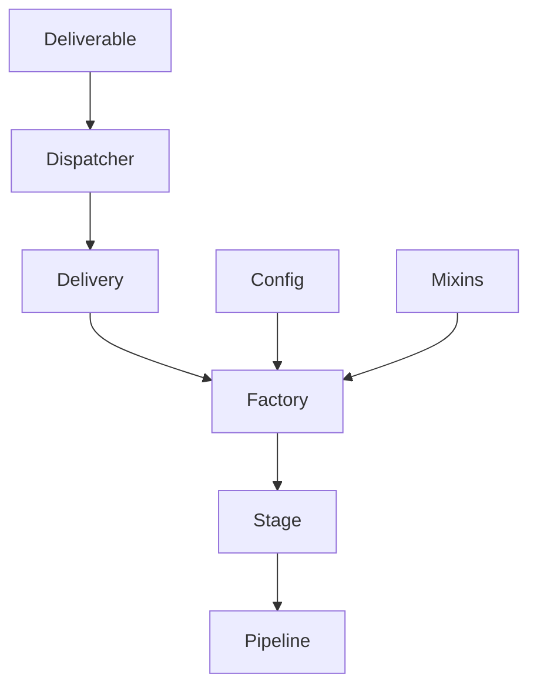

# Philosophy and Concepts

PySetl is built on a foundation of proven software engineering principles,
adapted specifically for the unique challenges of data engineering. This section
explores the core philosophies and architectural concepts that make PySetl both
powerful and predictable.

## Core Design Philosophy

### 1. **Type Safety First**

PySetl embraces Python's type system as a fundamental tool for preventing errors
before they reach production. Every component, from data schemas to workflow
configurations, is type-annotated and validated at design time.

**Benefits:**

- **Compile-time error detection**: Catch schema mismatches and type errors
during development
- **Self-documenting code**: Type annotations serve as living documentation
- **IDE support**: Enhanced autocomplete and refactoring capabilities
- **Confidence in refactoring**: Type checking ensures changes don't break
existing functionality

### 2. **Declarative Dependencies**

PySetl uses a declarative approach to define data dependencies through the
Delivery/Deliverable system. Dependencies are declared upfront as class
attributes, not discovered at runtime.

**Benefits:**

- **Predictable execution**: Clear dependency graph enables optimal execution order
- **Automatic injection**: Dependencies are resolved and injected by the dispatcher
- **Error isolation**: Failures are contained to specific factories
- **Type safety**: Dependencies are type-checked at design time

### 3. **Modular Architecture**

PySetl promotes a modular design where each component has a single
responsibility and clear interfaces. This enables composition, testing, and
maintenance across diverse data engineering scenarios.

**Benefits:**

- **Reusability**: Factories can be composed and reused across different
pipelines and projects. A data validation factory can be used in customer
analytics, financial reporting, and inventory management workflows.
- **Reproducibility**: The same factory produces identical results regardless
of the environment or data source. A data transformation factory will behave
consistently whether processing CSV files, database tables, or streaming data.
- **Scalability**: Modular components can be distributed, parallelized, and
scaled independently. Factories can be optimized individually, and stages can
be executed on different compute resources based on their requirements.
- **Extensibility**: New data sources, transformations, and storage systems
can be easily integrated by creating new factories and connectors. PySetl's
mixins and configuration system allow for seamless extension without modifying
core framework code.

## Building Blocks: From Simple to Complex

### 1. **Delivery: Declaring Dependencies**

A `Delivery` is a declarative input slot that tells PySetl "I need data of type X".

```python
from pysetl.workflow import Delivery
from typedspark import DataSet
from etl.schemas import Citizen

# Declare that you need DataSet[Citizen]
citizens_delivery = Delivery[DataSet[Citizen]]()

# Optionally specify the producer to resolve ambiguity
citizens_delivery = Delivery[DataSet[Citizen]](producer=CitizensFactory)
```

**Key Point**: Delivery is just a declaration - it doesn't contain data yet.

### 2. **Deliverable: Runtime Data Containers**

A `Deliverable` is the actual data that fulfills a Delivery dependency.

```python
from pysetl.workflow import Deliverable

# Create deliverable from external data
citizens_deliverable = Deliverable[DataSet[Citizen]](
    payload=citizens_data,
    delivery_id="external_citizens"
)
```

**Key Point**: Deliverable is the runtime container that gets injected into Delivery slots.

### 3. **Factory: The Atomic Processing Unit**

Factories are the fundamental units of data processing. They declare dependencies
and implement the ETL lifecycle.

```python
from pysetl.workflow import Factory, Delivery
from typedspark import DataSet
from etl.schemas import Citizen

class CitizensFactory(Factory[DataSet[Citizen]]):
    """Factory that produces DataSet[Citizen]"""

    # Declare dependencies
    citizens_delivery = Delivery[DataSet[Citizen]]()

    def read(self) -> Self:
        # Get injected dependency
        self.citizens = self.citizens_delivery.get()
        return self

    def process(self) -> Self:
        # Transform data
        return self

    def write(self) -> Self:
        # Persist data (optional)
        return self

    def get(self) -> DataSet[Citizen]:
        # Return result for downstream consumers
        return self.citizens
```

**Key Points**:

- Four mandatory methods: `read()`, `process()`, `write()`, `get()`
- Dependencies declared as class attributes
- Method chaining with `return self`
- Type safety through generics

### 4. **Stage: Collections of Factories**

Stages group related factories together for sequential execution.

```python
from pysetl.workflow import Stage

# Create stage and add factories
stage = (
    Stage()
    .add_factory_from_type(CitizensFactory)
    .add_factory_from_type(CitiesFactory)
)
```

**Key Points**:

- Factories within a stage execute sequentially
- Stages provide organization and order
- Optional benchmarking and Spark integration

### 5. **Pipeline: Orchestrating Everything**

Pipelines orchestrate the complete data processing journey, managing dependencies
and execution order.

```python
from pysetl import PySetl

# Build and execute pipeline
pipeline = (
    PySetl.builder()
    .set_config(SETTINGS)
    .getOrCreate()
    .new_pipeline()
    .set_input_from_deliverable(citizens_deliverable)
    .add_stage(extraction_stage)
    .add_stage_from_type(TransformationFactory)
)

result = pipeline.run()
```

**Key Points**:

- Automatically resolves dependencies
- Builds execution DAG from type relationships
- Validates all dependencies before execution

## Advanced Concepts

### Dependency Injection Through Dispatcher

The dispatcher automatically matches Deliverables to Deliveries and injects
values at runtime.

```python
class ConsumerFactory(Factory[DataSet[Result]]):
    # Declare dependency
    input_delivery = Delivery[DataSet[Input]](producer=ProducerFactory)

    def read(self) -> Self:
        # Automatically injected by dispatcher
        self.input_data = self.input_delivery.get()
        return self
```

**Key Point**: No manual wiring - the dispatcher handles everything automatically.

### Multiple Dependencies

Factories can declare multiple dependencies with different producers.

```python
class JoinFactory(Factory[DataSet[JoinedData]]):
    # Multiple dependencies with explicit producers
    citizens_delivery = Delivery[DataSet[Citizen]](producer=CitizensFactory)
    cities_delivery = Delivery[DataSet[City]](producer=CitiesFactory)

    def read(self) -> Self:
        self.citizens = self.citizens_delivery.get()
        self.cities = self.cities_delivery.get()
        return self
```

### Mixins: Composable Behavior

Mixins provide optional functionality to components.

```python
from pysetl.utils.mixins import HasLogger

class AdvancedFactory(Factory[Data], HasLogger):
    def process(self) -> Self:
        self.logger.info("Processing data")
        # ... processing logic
        return self
```

**Available Mixins**:

- **HasLogger**: Built-in logging
- **HasBenchmark**: Performance measurement
- **HasDiagram**: Visual representation
- **IsConfigurable**: Configuration management
- **IsIdentifiable**: Unique identification

### Type-Safe Configuration

Configuration is validated using Pydantic models.

```python
from pysetl.config import CsvConfig
from pysetl.enums import FileStorage, SaveMode

csv_config = CsvConfig(
    storage=FileStorage.CSV,
    path="/data/citizens.csv",
    inferSchema="true",
    header="true"
)
```

**Key Point**: Configuration is validated at creation time, preventing runtime errors.

## Architecture Overview



## Design Principles in Action

1. **Fail Fast, Fail Safe**: PySetl detects errors as early as possible in the
development cycle, preventing issues from reaching production.

2. **Explicit Over Implicit**: All dependencies, types, and relationships are
explicitly declared, making code self-documenting and predictable.

3. **Composition Over Inheritance**: PySetl favors composition through
#mixins and dependency injection over complex inheritance hierarchies.

4. **Testability by Design**: Every component is designed to be easily testable
in isolation, promoting high test coverage and confidence.

5. **Observability Built-in**: Logging, benchmarking, and monitoring are
integrated into the core architecture, not added as afterthoughts.

## Next Steps

Now that you understand PySetl's philosophy and core concepts, explore the
practical implementation:

- **[Configuration Guide](configuration.md)**: Learn how to configure PySetl for
your environment
- **[Workflow Guide](workflow.md)**: Build your first data processing workflow
- **[Data Access Layer](dal.md)**: Understand how PySetl handles data storage
and retrieval
- **[PySetl Context](pysetl_context.md)**: Master the context system for
dependency management

Each of these guides builds upon the concepts introduced here, showing how
PySetl's philosophy translates into practical, maintainable data engineering
solutions.
